# LAYER_1 Architecture & Data Flow

## Complete Pipeline Diagram

```mermaid
flowchart TB
    Start([Audio File Input<br/>MP3/WAV/FLAC]) --> PreCheck{Preprocessing<br/>Option?}
    
    PreCheck -->|1. As-is| Diarize
    PreCheck -->|2. Denoise| Denoise[Resemble-Enhance<br/>Denoiser]
    PreCheck -->|3. Enhance| Enhance[Resemble-Enhance<br/>Enhancer Stage2]
    PreCheck -->|4. Both| Denoise
    
    Denoise --> DenoisedAudio[Denoised Audio<br/>16kHz WAV]
    Enhance --> EnhancedAudio[Enhanced Audio<br/>16kHz WAV]
    Denoise --> Enhance
    
    DenoisedAudio --> Diarize
    EnhancedAudio --> Diarize
    
    Diarize[Speaker Diarization<br/>pyannote/segmentation-3.0<br/>+ wespeaker-resnet34] --> Segments[(Audio Segments<br/>with Timestamps<br/>SPEAKER_A: 0-5s<br/>SPEAKER_B: 5-10s)]
    
    Segments --> Transcribe[Transcription<br/>SenseVoice Model<br/>iic/SenseVoiceSmall]
    
    Transcribe --> RawTranscript[(Raw Transcript<br/>+ Generic Labels<br/>SPEAKER_A: text<br/>SPEAKER_B: text)]
    
    RawTranscript --> RoleCheck{Role ID<br/>Enabled?}
    
    RoleCheck -->|Yes| RoleID[Role Identification<br/>Llama-3.1-8B-Instruct<br/>identify-call-roles skill]
    RoleCheck -->|No| EmotionCheck
    
    RoleID --> RoleTranscript[(Transcript with Roles<br/>Agent: text<br/>Customer: text)]
    
    RoleTranscript --> EmotionCheck{Emotion<br/>Detection?}
    
    EmotionCheck -->|No| Output1[Output Files<br/>TXT + JSON]
    EmotionCheck -->|Yes| EmotionModel[Audio Emotion Analysis<br/>NVIDIA Audio2Emotion-v3.0<br/>ONNX Model]
    
    EmotionModel --> EmotionData[(Emotion Labels<br/>per Segment<br/>anger/joy/fear<br/>disgust/sad/neutral)]
    
    EmotionData --> Merge[Merge Emotions<br/>with Transcript]
    
    Merge --> FinalOutput[Final Output Files<br/>TXT + JSON<br/>with Roles + Emotions]
    
    Output1 --> End([Complete])
    FinalOutput --> End
    
    style Start fill:#e1f5ff
    style End fill:#c8e6c9
    style Denoise fill:#fff3e0
    style Enhance fill:#fff3e0
    style Diarize fill:#f3e5f5
    style Transcribe fill:#e8eaf6
    style RoleID fill:#fce4ec
    style EmotionModel fill:#fff9c4
    style Output1 fill:#c8e6c9
    style FinalOutput fill:#c8e6c9
```

<!-- [MermaidChart: be32ea39-b10b-4b85-8e23-2e28e05f70e4] -->
<!-- [MermaidChart: be32ea39-b10b-4b85-8e23-2e28e05f70e4] -->
<!-- [MermaidChart: be32ea39-b10b-4b85-8e23-2e28e05f70e4] -->


## Data Transformation Journey

### Stage 1: Input & Preprocessing
**Input:**
```
audio_file.mp3
- Format: Any (MP3, WAV, FLAC, etc.)
- Sample Rate: Variable
- Channels: Mono or Stereo
```

**After Preprocessing:**
```
audio_processed.wav
- Format: WAV PCM_16
- Sample Rate: Original SR (preserved)
- Channels: Mono
- Quality: Denoised and/or Enhanced
```

**Models Used:**
- `resemble-enhance/denoiser` - Removes background noise
- `resemble-enhance/enhancer_stage2` - Improves audio clarity

---

### Stage 2: Speaker Diarization
**Input:**
```python
audio_processed.wav
```

**Processing:**
```python
Model: pyannote/segmentation-3.0 + wespeaker-voxceleb-resnet34-LM
Output: Speaker segments with timestamps
```

**Output:**
```json
[
  {"start": 0.0, "end": 5.2, "speaker": "SPEAKER_A"},
  {"start": 5.5, "end": 8.3, "speaker": "SPEAKER_B"},
  {"start": 8.7, "end": 12.1, "speaker": "SPEAKER_A"}
]
```

---

### Stage 3: Speech Transcription
**Input:**
```
Audio segments + timestamps
```

**Processing:**
```python
Model: SenseVoice (iic/SenseVoiceSmall)
- Converts speech to text
- Detects sound events (laughter, applause, etc.)
- Text emotion detection: DISABLED
```

**Output:**
```json
{
  "transcript": [
    {
      "id": 1,
      "start": 0.0,
      "end": 5.2,
      "speaker": "SPEAKER_A",
      "text": "Hello, how can I help you?",
      "emotion": "EMO_UNKNOWN",
      "event": "Speech",
      "signals": ["QUESTIONING"]
    },
    {
      "id": 2,
      "start": 5.5,
      "end": 8.3,
      "speaker": "SPEAKER_B",
      "text": "I have a problem with my order.",
      "emotion": "EMO_UNKNOWN",
      "event": "Speech",
      "signals": ["FRUSTRATED"]
    }
  ]
}
```

**Behavioral Signals Detected:**
- QUESTIONING - Questions in text
- FRUSTRATED - Frustration indicators
- APOLOGETIC - Apologies
- SATISFIED - Thank you, great, etc.
- CONFUSED - Unclear, don't understand
- HESITANT - Um, uh, hmm
- ESCALATION - Manager, complaint

---

### Stage 4: Role Identification (Optional)
**Input:**
```python
Transcript with generic labels (SPEAKER_A, SPEAKER_B)
```

**Processing:**
```python
Model: Meta-Llama-3.1-8B-Instruct-Q8_0.gguf
Skill: identify-call-roles
Method: Analyzes conversation patterns, professional language, problem descriptions
```

**Output:**
```json
{
  "role_mapping": {
    "SPEAKER_A": "Customer Service Agent",
    "SPEAKER_B": "Customer"
  },
  "confidence": 0.95,
  "evidence": [
    {"speaker": "SPEAKER_A", "quote": "Hello, how can I help you?"},
    {"speaker": "SPEAKER_B", "quote": "I have a problem with my order."}
  ]
}
```

**Updated Transcript:**
```json
{
  "transcript": [
    {
      "speaker": "Customer Service Agent",
      "role": "Customer Service Agent",
      "text": "Hello, how can I help you?"
    },
    {
      "speaker": "Customer",
      "role": "Customer",
      "text": "I have a problem with my order."
    }
  ]
}
```

---

### Stage 5: Audio Emotion Detection (Optional)
**Input:**
```python
Audio segments + Transcript with roles
```

**Processing:**
```python
Model: NVIDIA Audio2Emotion-v3.0 (ONNX)
- Loads each audio segment (start→end)
- Resamples to 16kHz
- Pads to minimum 10,000 samples
- Runs through neural network
- Outputs 6 emotion probabilities
```

**Emotion Categories:**
- anger
- disgust
- fear
- joy
- neutral
- sadness

**Output per Segment:**
```json
{
  "audio_emotion": "anger",
  "audio_emotion_confidence": 0.74,
  "audio_emotion_scores": {
    "anger": 0.74,
    "disgust": 0.03,
    "fear": 0.01,
    "joy": 0.12,
    "neutral": 0.09,
    "sadness": 0.01
  }
}
```

---

### Stage 6: Final Output

#### JSON Output
```json
{
  "call_metadata": {
    "file": "call_recording.wav",
    "duration_seconds": 90.75,
    "num_speakers": 2,
    "total_segments": 40,
    "roles_identified": true,
    "role_mapping": {
      "SPEAKER_A": "Customer Service Agent",
      "SPEAKER_B": "Customer"
    }
  },
  "speaker_summary": {
    "Customer Service Agent": {
      "talk_time_seconds": 19.79,
      "talk_time_pct": 21.8,
      "median_pitch_hz": null,
      "behavioral_signals": {
        "QUESTIONING": 4,
        "SATISFIED": 1
      },
      "role": "Customer Service Agent"
    },
    "Customer": {
      "talk_time_seconds": 70.96,
      "talk_time_pct": 78.2,
      "behavioral_signals": {
        "QUESTIONING": 1,
        "FRUSTRATED": 3
      },
      "role": "Customer"
    }
  },
  "transcript": [
    {
      "id": 1,
      "start": 6.93,
      "end": 8.59,
      "speaker": "Customer Service Agent",
      "role": "Customer Service Agent",
      "emotion": "EMO_UNKNOWN",
      "event": "Speech",
      "signals": ["QUESTIONING"],
      "text": "Hello, how can I help you?",
      "audio_emotion": "joy",
      "audio_emotion_confidence": 0.79,
      "audio_emotion_scores": {
        "anger": 0.15,
        "disgust": 0.01,
        "fear": 0.03,
        "joy": 0.79,
        "neutral": 0.01,
        "sadness": 0.00
      }
    }
  ],
  "metadata": {
    "audio_emotion_model": "nvidia/Audio2Emotion-v3.0",
    "audio_emotion_processed": true
  }
}
```

#### TXT Output
```
════════════════════════════════════════════════════════════════════════════════
  TRANSCRIPTION WITH SPEAKER DIARIZATION + AUDIO EMOTION
  (Audio-based emotion detection using NVIDIA Audio2Emotion-v3.0)
  File     : call_recording.wav
  Speakers : 2
════════════════════════════════════════════════════════════════════════════════

[00:06→00:08]  Customer Service Agent  [JOY:0.79]
    Hello, how can I help you?

[00:09→00:13]  Customer  [ANGER:0.74]
    I have a problem with my order.

[00:13→00:18]  Customer  [ANGER:0.89]
    It arrived damaged and nobody is responding to my emails.

[00:18→00:20]  Customer Service Agent  [NEUTRAL:0.65]  [QUESTIONING]
    I understand your frustration. Can you provide your order number?

────────────────────────────────────────────────────────────────────────────────
  ANALYSIS SUMMARY
────────────────────────────────────────────────────────────────────────────────
  Total speech time : 1m 30s
  Segments          : 40

  Customer Service Agent
    Talk time        : 19s (22%)
    Signals          : [QUESTIONING]x4  [SATISFIED]x1

  Customer
    Talk time        : 1m 10s (78%)
    Signals          : [QUESTIONING]x1  [FRUSTRATED]x3

  EMOTION ANALYSIS SUMMARY
  
  Customer Service Agent
    Audio emotions detected: 11 segments
      joy: 4 (36.4%)
      neutral: 5 (45.5%)
      anger: 2 (18.2%)

  Customer
    Audio emotions detected: 29 segments
      anger: 27 (93.1%)
      disgust: 1 (3.4%)
      joy: 1 (3.4%)

  Sound events detected :
    None (speech only)
════════════════════════════════════════════════════════════════════════════════
```

---

## Model Specifications

### 1. Resemble-Enhance
- **Purpose:** Audio preprocessing
- **Location:** `LAYER_1/resemble-enhance/`
- **Config:** `config/denoiser.yaml`, `config/enhancer_stage2.yaml`
- **Input:** Raw audio (any format)
- **Output:** Clean 16kHz mono WAV

### 2. Pyannote Segmentation 3.0
- **Purpose:** Speaker diarization
- **Location:** `LAYER_1/models/pyannote/segmentation-3.0/`
- **Model File:** `pytorch_model.bin`
- **Input:** Audio waveform
- **Output:** Speaker change timestamps

### 3. WeSpeaker ResNet34-LM
- **Purpose:** Speaker embedding
- **Location:** `LAYER_1/models/pyannote/wespeaker-voxceleb-resnet34-LM/`
- **Model File:** `pytorch_model.bin`
- **Input:** Audio segments
- **Output:** Speaker embeddings for clustering

### 4. SenseVoice Small
- **Purpose:** Speech-to-text transcription
- **Location:** `LAYER_1/models/sensevoice/iic/SenseVoiceSmall/`
- **Input:** Audio segments with speaker labels
- **Output:** Text transcription
- **Note:** Emotion detection disabled (unreliable)

### 5. Meta-Llama-3.1-8B-Instruct
- **Purpose:** Role identification
- **Location:** `/home/mazen/grad_project/skill_implementation/models/`
- **Model File:** `Meta-Llama-3.1-8B-Instruct-Q8_0.gguf` (8-bit quantized)
- **Context:** 4096 tokens
- **Input:** First 30 transcript segments
- **Output:** Role labels (Agent/Customer/etc.)

### 6. NVIDIA Audio2Emotion-v3.0
- **Purpose:** Audio emotion detection
- **Location:** `LAYER_1/audio_emotion_detection_enhanced/models/Audio2Emotion-v3.0/`
- **Model File:** `network.onnx` (1.18 GB)
- **Backend:** ONNX Runtime (GPU accelerated)
- **Input:** 16kHz audio segments (min 10,000 samples)
- **Output:** 6 emotion probabilities
- **Emotions:** anger, disgust, fear, joy, neutral, sadness

---

## Processing Characteristics

| Stage | Processing Time | GPU Usage | Memory Usage |
|-------|----------------|-----------|--------------|
| Preprocessing | ~2-5s | Medium | ~2 GB |
| Diarization | ~5-10s | High | ~3 GB |
| Transcription | ~10-30s | High | ~4 GB |
| Role ID | ~5-10s | Medium | ~8 GB |
| Emotion Detection | ~20-40s | Medium | ~2 GB |
| **Total** | **~40-95s** | **High** | **~8 GB peak** |

*Times based on 2-minute audio file*

---

## Data Size Progression

```
Input Audio (MP3)              →  5 MB
Preprocessed Audio (WAV)       →  13 MB
Diarization Segments           →  5 KB (JSON)
Transcription                  →  15 KB (JSON)
+ Role Identification          →  15 KB (JSON + metadata)
+ Emotion Detection            →  30 KB (JSON + emotion scores)
Final TXT Output               →  5 KB
Final JSON Output              →  30 KB
```

---

## Key Features

✅ **Fully Offline** - All models run locally
✅ **GPU Accelerated** - Uses CUDA when available  
✅ **Role-Aware** - Identifies speakers as Agent/Customer/etc.
✅ **Emotion-Enhanced** - Audio-based emotion per segment
✅ **Behavioral Signals** - Detects questioning, frustration, satisfaction
✅ **High Quality** - Professional-grade transcription
✅ **Flexible** - Optional preprocessing and emotion detection
✅ **Structured Output** - Both human (TXT) and machine (JSON) readable

---

## Technology Stack

- **Audio Processing:** PyTorch, torchaudio, soundfile
- **Diarization:** pyannote.audio 3.1
- **Transcription:** FunASR (SenseVoice)
- **Role ID:** llama-cpp-python
- **Emotion:** ONNX Runtime
- **Language:** Python 3.11
- **Environment:** Conda (calltone)
- **Hardware:** CUDA-capable GPU (optional but recommended)
