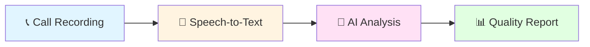

<div align="center">

# 🎙️ CallTone

### AI-Powered Quality Assurance for Customer Service Calls

[](https://opensource.org/licenses/MIT)
[]()
[]()

**Transforming call center quality management through artificial intelligence**

[Overview](#-overview) • [Problem](#-the-problem) • [Solution](#-our-solution) • [Team](#-team) • [Timeline](#-project-timeline) • [Contact](#-contact)

---

</div>

## 📖 Overview

**CallTone** is an intelligent system designed to revolutionize quality assurance in customer service call centers. By leveraging cutting-edge speech recognition and natural language processing technologies, CallTone automatically evaluates 100% of customer interactions, providing comprehensive insights that traditional manual QA cannot achieve.

<div align="center">

### 🎯 Core Objective

*Replace time-consuming manual call reviews with automated, scalable, and consistent AI-powered quality assessment*

</div>

---

## 🔍 The Problem

Call centers today struggle with **inefficient manual quality assurance** processes:

<table>
<tr>
<td width="25%" align="center">

### 📊 2-5%
**Coverage**

Only a tiny fraction of calls reviewed due to resource limits

</td>
<td width="25%" align="center">

### ⚖️ 15-30%
**Variance**

Inconsistent evaluations between different QA analysts

</td>
<td width="25%" align="center">

### ⏰ 1-3 Weeks
**Delay**

Feedback arrives too late to be actionable

</td>
<td width="25%" align="center">

### 💰 High Cost
**Scalability**

Manual QA teams don't scale with call volume

</td>
</tr>
</table>

### Business Impact
- **Compliance Risks**: Unmonitored calls may contain violations
- **Customer Churn**: Poor service quality drives customers away
- **Missed Insights**: Patterns across thousands of calls go undetected
- **Agent Development**: Inconsistent feedback hinders performance improvement

---

## 💡 Our Solution

CallTone provides **end-to-end automated quality assessment** with four key capabilities:

<div align="center">



</div>

### 🎯 Key Features

| Feature | Description |
|---------|-------------|
| **🎤 Automated Transcription** | Convert audio to text with speaker identification |
| **👥 Speaker Diarization** | Separate agent and customer speech segments |
| **🧠 Quality Assessment** | Evaluate compliance, politeness, resolution |
| **📈 Actionable Reports** | Generate insights with conversation excerpts |

### 📊 Quality Dimensions Evaluated

<div align="center">

| ✅ Script Compliance | 💬 Politeness & Tone | 🎯 Issue Resolution | ✔️ Factual Accuracy |
|:-------------------:|:-------------------:|:-------------------:|:------------------:|
| Did agent follow procedures? | Was interaction professional? | Was problem solved? | Was information correct? |

</div>

---

## 👥 Team

<div align="center">

### Zewail City of Science and Technology
**Fall 2025 - Spring 2026**

</div>

| 👤 Team Member | 🆔 ID | 🎓 Program | 💼 Role | 🔧 Technical Focus |
|----------------|-------|-----------|--------|-------------------|
| **Hothifa Hamdan** | 202201792 | DSAI | ML Architecture | Model development, training, evaluation |
| **Mazen Khaled** | 202201534 | DSAI | NLP Pipeline | Data processing, feature extraction |
| **Habiba Magdy** | 202202112 | SWD | System Integration | Backend API, software architecture |
| **Nasreldin Khaled** | 202201444 | IT (DSAI Minor) | Infrastructure | Audio processing, deployment |

<div align="center">

**Course**: CSAI 498/499 - Senior Project
**Supervisor**: *To Be Determined*

</div>

---

## 📅 Project Timeline

<div align="center">

### 🍂 Fall 2025 Semester (CSAI 498)
**September 21, 2025 - January 19, 2026**

</div>

```
Week 1-4   ║ 📚 Research & Requirements
           ║ → Literature review, dataset research, proposal finalization
           ║
Week 5-7   ║ 🏗️ Design & Planning
           ║ → Architecture design, environment setup, GitHub workflow
           ║
Week 8-16  ║ ⚙️ Implementation Part 1
           ║ → Audio transcription, speaker diarization, initial NLP pipeline
           ║
Week 17    ║ 🎯 Fall Deliverables
           ║ → Prototype demo, progress report, semester presentation
```

<div align="center">

### 🌸 Spring 2026 Semester (CSAI 499)
**February 8, 2026 - June 11, 2026**

</div>

```
Week 1-8   ║ ⚙️ Implementation Part 2
           ║ → NLP quality models, scoring system, web interface
           ║
Week 9-14  ║ 🧪 Testing & Evaluation
           ║ → Integration testing, user testing, performance optimization
           ║
Week 15-18 ║ 🎓 Finalization & Defense
           ║ → Final refinements, documentation, thesis, project defense
```

---

## 🛠️ Technology Stack

<div align="center">

### 🔍 Currently Under Research

*Technology choices will be finalized during Weeks 5-7 (Design & Planning phase)*

</div>

We are exploring various options across different components:

### 🎤 Audio Processing
- Researching speech recognition solutions
- Investigating speaker diarization approaches
- Evaluating audio preprocessing techniques

### 🧠 Natural Language Processing
- Exploring pre-trained language models
- Investigating text classification methods
- Researching sentiment analysis approaches

### 💻 Development Stack
- Backend frameworks and languages
- Database solutions
- Frontend technologies
- Deployment platforms

**All decisions will be documented as we finalize our technical approach.**

---

## 📊 Success Metrics

<div align="center">

### Technical Performance Targets

| Metric | Target | Measurement |
|--------|--------|-------------|
| **🎯 Transcription Accuracy** | WER < 15% | Compare with manual transcripts |
| **🤝 Human Agreement** | > 70% | AI vs. human evaluator scores |
| **⚡ Processing Speed** | < 5 min | 10-minute call processing time |
| **🎯 MVP Success** | > 60% | Agreement on ≥1 quality dimension |

</div>

---

## 🚀 Current Status

<div align="center">

### 📍 **Week 4 - Planning Phase**

**✅ Completed:**
- Project proposal drafted
- Team roles assigned
- GitHub repository initialized
- Technology research underway

**🔜 Next Steps:**
- Finalize project proposal submission
- Begin architecture design
- Set up development environment
- Start literature review

</div>

---

## 📄 Documentation

<div align="center">

| Document | Status | Link |
|----------|--------|------|
| 📋 Project Proposal | ✅ Complete | `docs/proposal/` (Coming Soon) |
| 🏗️ Architecture Design | 🔜 Planned | Week 5-7 |
| 📚 API Documentation | 🔜 Planned | Implementation Phase |
| 📖 User Guide | 🔜 Planned | Testing Phase |

</div>

---

## 📧 Contact

<div align="center">

**Have questions or want to collaborate?**

| Team Member | Email |
|-------------|-------|
| Hothifa Hamdan | s-hothifa.mohamed@zewailcity.edu.eg |
| Mazen Khaled | s-mazen.ahmed@zewailcity.edu.eg |
| Habiba Magdy | s-habiba.sayed@zewailcity.edu.eg |
| Nasreldin Khaled | s-nasreldin.mohamed@zewailcity.edu.eg |

</div>

---

<div align="center">

### 🎓 Academic Context

**Institution**: Zewail City of Science and Technology
**School**: Computing and Information Technology
**Course**: CSAI 498/499 - Senior Project
**Duration**: Fall 2025 - Spring 2026

---

### 📜 License

This project is licensed under the MIT License - see the [LICENSE](LICENSE) file for details.

---

<sub>Built with ❤️ by the CallTone Team | © 2025 Zewail City</sub>

</div>
