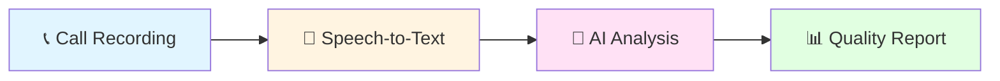

# 🎙️ CallTone

### AI-Powered Quality Assurance for Customer Service Calls

**Transforming call center quality management through artificial intelligence**

[Overview](#-overview) • [Problem](#-the-problem) • [Solution](#-our-solution) • [Team](#-team) • [Timeline](#-project-timeline) • [Contact](#-contact)

---

## 📖 Overview

**CallTone** is an intelligent system designed to revolutionize quality assurance in customer service call centers. By leveraging cutting-edge speech recognition and natural language processing technologies, CallTone automatically evaluates 100% of customer interactions, providing comprehensive insights that traditional manual QA cannot achieve.

### 🎯 Core Objective

*Replace time-consuming manual call reviews with automated, scalable, and consistent AI-powered quality assessment*

---

## 🔍 The Problem

Call centers today struggle with **inefficient manual quality assurance** processes:

<table>
<tr>
<td width="25%" align="center">

### 📊 2-5%
**Coverage**

Only a tiny fraction of calls reviewed due to resource limits

</td>
<td width="25%" align="center">

### ⚖️ 15-30%
**Variance**

Inconsistent evaluations between different QA analysts

</td>
<td width="25%" align="center">

### ⏰ 1-3 Weeks
**Delay**

Feedback arrives too late to be actionable

</td>
<td width="25%" align="center">

### 💰 High Cost
**Scalability**

Manual QA teams don't scale with call volume

</td>
</tr>
</table>

### Business Impact
- **Compliance Risks**: Unmonitored calls may contain violations
- **Customer Churn**: Poor service quality drives customers away
- **Missed Insights**: Patterns across thousands of calls go undetected
- **Agent Development**: Inconsistent feedback hinders performance improvement

---

## 💡 Our Solution

CallTone provides **end-to-end automated quality assessment** with four key capabilities:

### 🎯 Key Features

| Feature | Description |
|---------|-------------|
| **🎤 Automated Transcription** | Convert audio to text with speaker identification |
| **👥 Speaker Diarization** | Separate agent and customer speech segments |
| **🧠 Quality Assessment** | Evaluate compliance, politeness, resolution |
| **📈 Actionable Reports** | Generate insights with conversation excerpts |

### 📊 Quality Dimensions Evaluated

| ✅ Script Compliance | 💬 Politeness & Tone | 🎯 Issue Resolution | ✔️ Factual Accuracy |
|:-------------------:|:-------------------:|:-------------------:|:------------------:|
| Did agent follow procedures? | Was interaction professional? | Was problem solved? | Was information correct? |

---

## 👥 Team

### Zewail City of Science and Technology
**Fall 2025 - Spring 2026**

| 👤 Team Member | 🆔 ID | 🎓 Program | 💼 Role | 🔧 Technical Focus |
|----------------|-------|-----------|--------|-------------------|
| **Hothifa Hamdan** | 202201792 | DSAI | ML Architecture | Model development, training, evaluation |
| **Mazen Khaled** | 202201534 | DSAI | NLP Pipeline | Data processing, feature extraction |
| **Habiba Magdy** | 202202112 | SWD | System Integration | Backend API, software architecture |
| **Nasreldin Khaled** | 202201444 | IT (DSAI Minor) | Infrastructure | Audio processing, deployment |

**Course**: CSAI 498/499 - Senior Project
**Supervisor**: *Dr. Mohamed Fakhry Eldin Ghalwash*

---

## 📅 Project Timeline

### 🍂 Fall 2025 Semester (CSAI 498) - ✅ Completed
**September 21, 2025 - January 19, 2026**

**Major Accomplishments:**
- ✅ Comprehensive market analysis and competitive landscape review
- ✅ Three-layer system architecture designed (Audio Processing, NLP Analysis, Reporting/API)
- ✅ Technology stack finalized (Whisper, RoBERTa, FastAPI, PostgreSQL)
- ✅ 7 quality dimensions defined and validated
- ✅ 18-week implementation roadmap for Spring 2026 developed

### 🌸 Spring 2026 Semester (CSAI 499) - 🚀 Upcoming
**February 8, 2026 - June 11, 2026**

**Planned Phases:**
- 🔜 **Phase 1 (Weeks 1-8)**: Complete NLP implementation, data augmentation, web dashboard
- 🔜 **Phase 2 (Weeks 9-14)**: Testing, evaluation, and human-AI agreement analysis
- 🔜 **Phase 3 (Weeks 15-18)**: Final system polish, thesis writing, defense preparation

---

## 🛠️ Technology Stack

### ✅ Finalized Architecture

*Based on Fall 2025 research and design phase*

### 🎤 Audio Processing Layer
- **ASR**: OpenAI Whisper (large-v3) with Wav2Vec2 fallback
- **Diarization**: Speaker separation for Agent vs. Customer identification
- **Format**: 16kHz, 16-bit mono PCM WAV

### 🧠 NLP Analysis Layer
- **Base Model**: RoBERTa-base (fine-tuned on customer service corpus)
- **Framework**: PyTorch, Hugging Face Transformers
- **Quality Dimensions**: 7 dimensions (Script Compliance, Factual Accuracy, Politeness, Empathy, Conflict, Resolution, Severity)

### 💻 Backend & API
- **Framework**: FastAPI (async ML inference)
- **Database**: PostgreSQL (relational data), MongoDB (logs/documents)
- **Caching**: Redis
- **Storage**: AWS S3 (audio files, models)

### 📊 Performance Targets

| Metric | Target | Measurement |
|--------|--------|-------------|
| **🎯 WER (Word Error Rate)** | < 15% (MVP), < 8% (Prod) | Compared to manual transcripts |
| **🤝 Human Agreement** | > 70% | Cohen's Kappa > 0.75 |
| **⚡ Processing Speed** | < 5 minutes | For 10-minute call |

---

## 🚀 Current Status

### 📍 **Fall 2025 Completed - Entering Spring 2026 Implementation**

**✅ Fall 2025 Achievements:**
- System architecture finalized
- Technology stack selected and validated
- Quality assessment framework established (7 dimensions)
- Market research and competitive analysis completed
- Implementation roadmap developed

**🔜 Spring 2026 Next Steps:**
- Begin full NLP model implementation
- Develop data augmentation pipeline
- Build web dashboard and API
- Conduct testing and evaluation with human analysts

---

## 📄 Documentation

| Document | Status | Description |
|----------|--------|-------------|
| 📋 Final Report (Fall 2025) | ✅ Complete | Comprehensive planning & design document |
| 🏗️ Architecture Design | ✅ Complete | Three-layer system architecture |
| 📊 Implementation Roadmap | ✅ Complete | 18-week Spring 2026 plan |
| 🔜 API Documentation | Planned | Spring 2026 implementation phase |
| 🔜 User Guide | Planned | Spring 2026 testing phase |

---

## 📧 Contact

**Have questions or want to collaborate?**

| Team Member | Email |
|-------------|-------|
| Hothifa Hamdan | s-hothifa.mohamed@zewailcity.edu.eg |
| Mazen Khaled | s-mazen.ahmed@zewailcity.edu.eg |
| Habiba Magdy | s-habiba.sayed@zewailcity.edu.eg |
| Nasreldin Khaled | s-nasreldin.mohamed@zewailcity.edu.eg |

---

### 🎓 Academic Context

**Institution**: Zewail City of Science and Technology
**School**: Computer Science and Artificial Intelligence (CSAI)
**Course**: CSAI 498/499 - Senior Project
**Academic Year**: 2025-2026
**Project Phase**: Transitioning from Planning (Fall 2025) to Implementation (Spring 2026)

---

Built with ❤️ by the CallTone Team | © 2025-2026 Zewail City

